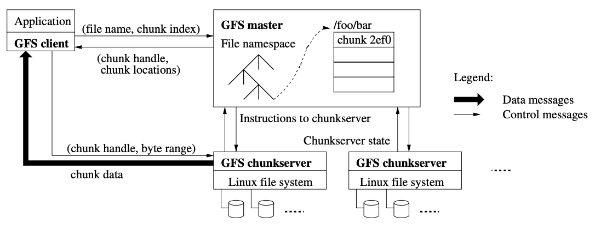

# Lecture 3: GFS

### Why it is hard to keep global file system?
* **Performance**: Data stored in distributed system are horizontally partitioned on separate server instances, to spread load. This is called sharding.
* **Fault Tolerance**: When large number of machines are involved, there will always be some make mistakes. We need **replications** for restoration.
* **Replication**: Use of replication may result in **inconsistency**, to maintain the **consistency**, the system might result in **low performance**.

### Introduction to GFS:
* Definition to **volatile and non-volatile memory**: Volatile Memory is used to store computer programs and data that CPU needs in real time and is erased once computer is switched off. RAM and Cache memory are volatile memory. Where as Non-volatile memory is static and remains in the computer even if computer is switched off. ROM and HDD are non-volatile memory.
* Basic operations of GFS:
  - Fundamental operations of all file systems, including **create**, **delete**, **open**, **close**, **read**, and **write**.
  - **Snapshot**: creates a copy of a file or a directory tree at low cost. 
  - **Record Append**: allows multiple clients to append data to the same file *concurrently* while guaranteeing the *atomicity* of each individual client’s append.
* GFS Architecture
  |  | 
  |:--:| 
  - A **single master** and **multiple chunk servers**. 
  - **Master** stores directoriies and filenames in tree structrue.
  - **Chunk servers** store all chunk of data using linux file system.
  - Each **file** is divided into *fixed-size* **chunks**.
  - Each **chunk** is identified by an *immutable and globally unique* 64 bit **chunk handle** assigned by the master *at the time of chunk creation*.
  - For reliability, **each chunk** is replicated on 3 other chunkservers by default, though users can designate different replication levels.
* Difficult points in GFS system:
  - Operation log and checkpoints: how are the checkpoints actually implemented?
  - 
